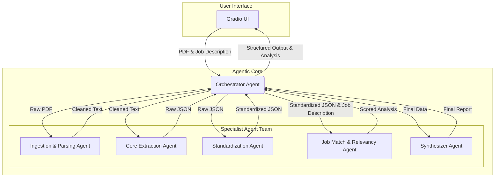

# CV-Scout: A Multi-Agent Resume Intelligence System

An AI-powered system designed to transform unstructured resume PDFs into actionable, structured data and perform intelligent job-to-candidate matching. This project demonstrates an end-to-end multi-agent workflow using Langchain(LangGraph) and the Google Gemini API.

 
*(This is a placeholder image. You should replace this with a screenshot of your actual Gradio application.)*

## 🚀 Project Vision

In today's competitive job market, recruiters and hiring managers are inundated with resumes. The initial screening process is manual, time-consuming, and prone to inconsistency. CV-Scout addresses this challenge by leveraging a sophisticated multi-agent AI system to automate the analysis of candidate resumes.

The system ingests a candidate's PDF resume, converts the unstructured data into a clean, structured format, and evaluates the candidate's profile against a provided job description, offering a quantitative score and a qualitative analysis. This project is a practical implementation of the principles of complex workflow automation and AI-driven data intelligence.

## ✨ Core Features

*   **PDF Resume Parsing:** Upload any standard resume in PDF format.
*   **Structured Data Extraction:** Automatically identifies and extracts key information such as contact details, work experience, education, and skills.
*   **Job-to-Candidate Matching:** Scores the resume against a job description to quantify candidate-role fit.
*   **AI-Powered Analysis:** Provides a brief, human-readable summary explaining the compatibility score, highlighting strengths and potential gaps.
*   **Interactive UI:** A simple and intuitive user interface built with Gradio for easy demonstration and use.

## 🛠️ Technical Architecture

CV-Scout is architected as a robust multi-agent system where a central **Orchestrator Agent** manages a team of specialized agents. This design ensures modularity, scalability, and clarity of purpose for each component. The entire workflow is managed using **Langchain's LangGraph** framework, which is ideal for creating cyclical and stateful agentic applications.

### The Agent Team:
*   **Orchestrator Agent (The Manager):** Built with LangGraph, it manages the state and sequence of the entire operation, delegating tasks to the appropriate specialist agent.
*   **Ingestion & Parsing Agent:** Uses `PyMuPDF` to extract raw text from the uploaded PDF and performs initial text cleaning.
*   **Core Extraction Agent:** Leverages the **Gemini API** with advanced prompt engineering to perform Named Entity Recognition (NER) and extract key details into a raw JSON format.
*   **Standardization Agent:** A crucial quality control step. This agent cleans the extracted data, standardizing formats (e.g., dates) and ensuring consistency.
*   **Job Match & Relevancy Agent (RAG):** Implements a **Retrieval-Augmented Generation (RAG)** pattern. It compares the structured resume data against the job description to generate a compatibility score and a qualitative summary.
*   **Synthesizer Agent:** Compiles all the structured data and the relevancy analysis into a final, clean JSON object and a human-readable report for the UI.

## ⚙️ Tech Stack

*   **Programming Language:** Python
*   **Core AI Framework:** Langchain (utilizing LangGraph for agent orchestration)
*   **LLM:** Google Gemini API
*   **PDF Parsing:** PyMuPDF (`fitz`)
*   **UI Framework:** Gradio

## 🗺️ Project Stages

The development of CV-Scout followed a structured, iterative process.

Stage 1: Core Functionality & MVP [✅]      
Stage 2: Implementing the Multi-Agent Architecture [✅]      
Stage 3: Advanced Feature Integration & Analysis [✅]      

### Stage 1: Core Functionality & MVP 

The initial goal was to validate the core concept: extracting structured data from a PDF. This stage focused on creating a Minimum Viable Product (MVP) with a single, monolithic Langchain chain.
*   **Objective:** Successfully parse a PDF and extract the candidate's name and email.
*   **Implementation:** A simple Python script combining `PyMuPDF` and a Langchain chain calling the Gemini API.
*   **Outcome:** Proved the viability of the core technology stack and established a baseline for more complex development.

### Stage 2: Implementing the Multi-Agent Architecture

Moving from a single chain to a sophisticated multi-agent system was the key architectural evolution. This stage focused on building the robust, orchestrated workflow described in the architecture diagram.
*   **Objective:** Decompose the single chain into specialized agents managed by an orchestrator.
*   **Implementation:** Refactored the codebase to use **LangGraph**. Created individual agents for ingestion, extraction, and standardization, each with a clearly defined role and state.
*   **Outcome:** A highly modular and scalable system that mirrors real-world team collaboration, improving robustness and maintainability.

### Stage 3: Advanced Feature Integration & Analysis

With the agentic foundation in place, this final stage focused on adding high-value business intelligence, transforming the tool from a simple parser into a decision-support system.
*   **Objective:** Add the ability to score a resume against a job description.
*   **Implementation:** Developed the **Relevancy Agent** using a RAG approach to provide contextually-aware analysis. The Gradio UI was updated to accept the job description as a second input.
*   **Outcome:** Significantly enhanced the project's utility by providing immediate, actionable insights for the user, demonstrating a clear understanding of building business-focused AI solutions.

## 🚀 Setup and Installation
will be added later.

## 🔮 Future Improvements

*   **Batch Processing:** Allow users to upload multiple resumes for simultaneous analysis.
*   **Database Integration:** Store the structured outputs in a database (e.g., SQLite, PostgreSQL) for long-term storage and trend analysis.
*   **Dockerization:** Containerize the application for easier deployment and scalability.
*   **Enhanced UI Features:** Add features like resume comparison, skill gap analysis, and candidate ranking.
*   **Fine-Tuning:** Fine-tune a smaller, open-source model on a curated dataset of resumes to improve accuracy and reduce API costs.
*   **Expanded Skill Ontology:** Develop a more sophisticated system for classifying skills into predefined categories to enhance search and filtering capabilities.